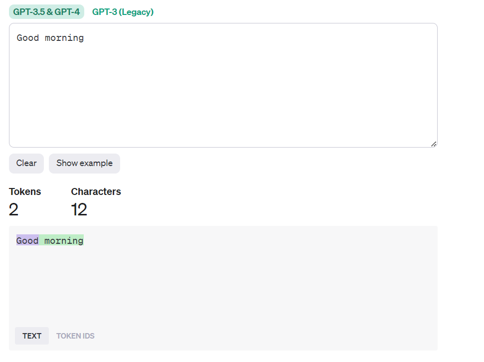
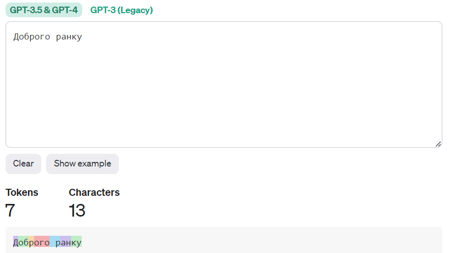
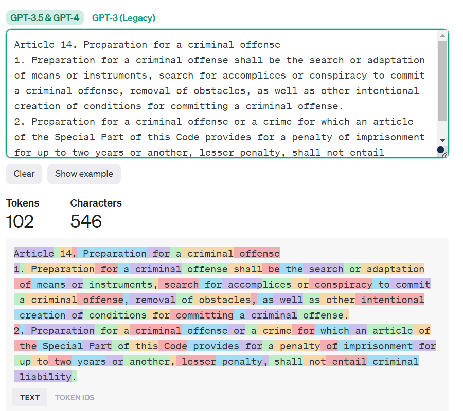
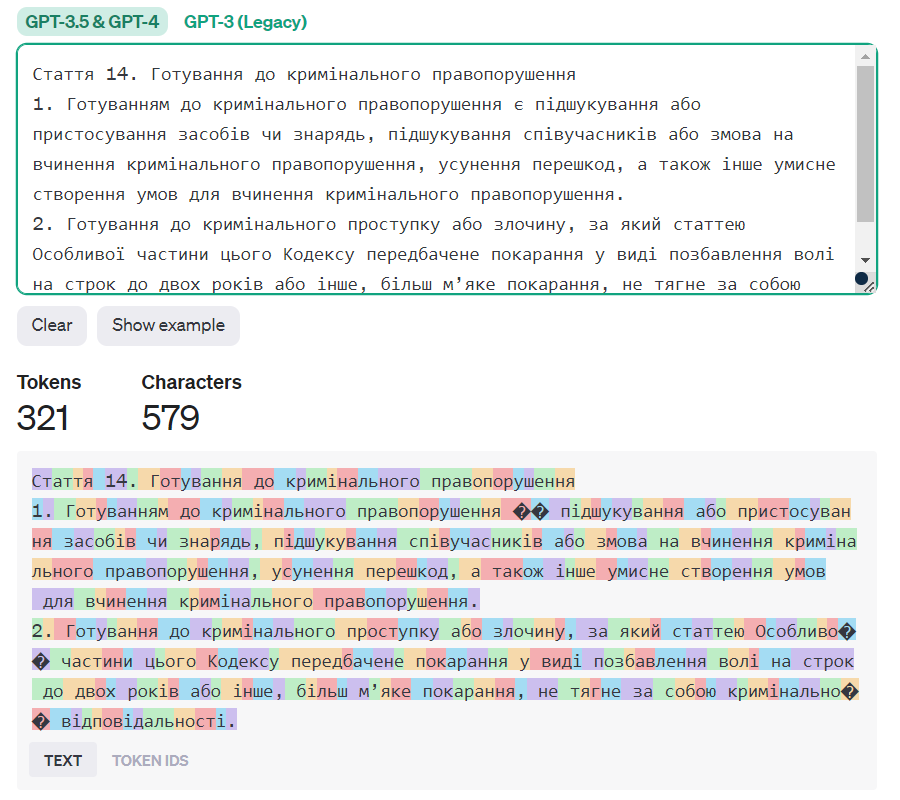

# lawyer_chatbot

The goal of this project is to develop an assistant that will be able to give criminal law qualifications with high accuracy and from different perspectives. Responses will be based on Criminal Code of Ukraine(ccU).


Taking into account that the chatbot will process Ukrainian requests and respond in the same language, I chose GPT-3.5 Turbo/4 from openai API as the main model, as it works best with foreign languages. But vanil gpt can't meet requirements. It was trained on 2021 data, so some knowledge is currently outdated, so it is necessary to update model knowledge. 
To update the LLM model I found 4 main approaches: Prompting, Embeddins, Agents and, in a pinch, Fine-tuning. In some cases combination of approaches can yield excellent result.

Before considering the approaches, it is important to talk about tokenization. 
Tokenization - the process of converting a sequence of text into smaller units, known as tokens. Thanks to this process, the model begins to understand and process the meaning of words. I use tokenizer for GPT-3.5.
1 token ~= ¾ English words. So 1000 Eng words is about 750 tokens. But the tokenizer converts words of other languages differently. It divides them into even smaller units therefore the total number of units and the price are higher. For exaple:

Let's take two identical sentenceі in different languages(Eng, Ukr):
<div style="display: flex; justify-content: space-between;">
    
    
</div>
Difference in the number of tokens three times.

Now try to compare article:
<div style="display: flex; justify-content: space-between;">
    
    
</div>


...

## Architecture

The assistant is a **RAG** (Retrieval-Augmented Generation) application:

1. `ingest.py` splits the Criminal Code (`docs/ukr_cc_ready.txt`) into one chunk per
   article (`Стаття N.`), embeds them with OpenAI embeddings and stores the vectors
   in an **embedded Qdrant** vector database that runs in-process and persists to a
   local folder (`qdrant_data/`) — no server or separate container required.
2. `chatbot.py` retrieves the most relevant articles for a question and asks the LLM
   to give a legal qualification grounded in that retrieved context.
3. `app.py` is a Streamlit chat UI on top of the chatbot.

```
docs/ ──ingest.py──▶ Qdrant (vectors) ──chatbot.py──▶ LLM ──app.py──▶ chat UI
```

| File | Purpose |
| --- | --- |
| `config.py` | Settings loaded from `.env` |
| `vectorstore.py` | Embedded Qdrant + embeddings helpers |
| `ingest.py` | Build/refresh the knowledge base |
| `chatbot.py` | RAG retrieval + answering chain |
| `app.py` | Streamlit chat interface |

Qdrant is embedded — it runs inside the Python process and stores its data in the
`qdrant_data/` folder. There is nothing separate to start.

## Quickstart (local)

```bash
python -m venv .venv && source .venv/bin/activate
pip install -r requirements.txt
cp .env.example .env          # add your OPENAI_API_KEY

python ingest.py --recreate   # build the vector index into qdrant_data/
streamlit run app.py          # launch the chat UI
```

Open http://localhost:8501

> Note: the embedded Qdrant store can be opened by only one process at a time.
> Stop the Streamlit app before re-running `python ingest.py`, and vice versa.

## Quickstart (Docker)

```bash
cp .env.example .env          # add your OPENAI_API_KEY
docker compose up -d --build  # builds and starts just the app
# one-time: build the vector index inside the running app container
docker compose exec app python ingest.py --recreate
```

The vector index is persisted in the `qdrant_data` Docker volume.
