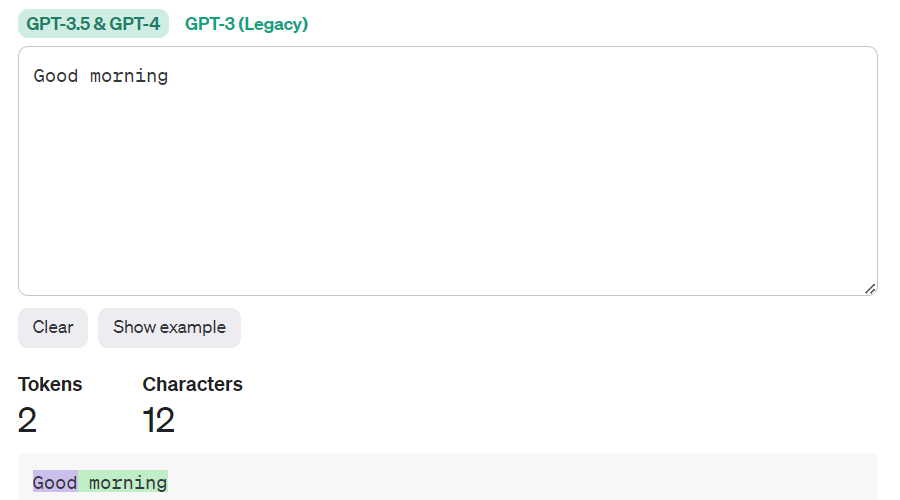

# lawyer_chatbot

The goal of this project is to develop an assistant that will be able to give criminal law qualifications with high accuracy and from different perspectives. Responses will be based on Criminal Code of Ukraine(ccU).

Taking into account that the chatbot will process Ukrainian requests and respond in the same language, I chose GPT-3.5 Turbo/4 from openai API as the main model, as it works best with foreign languages. But vanil gpt can't meet requirements. It was trained on 2021 data, so some knowledge is currently outdated, so it is necessary to update model knowledge. 
To update the LLM model I found 4 main approaches: Prompting, Embeddins, Agents and, in a pinch, Fine-tuning. In some cases combination of approaches can yield excellent result.

Before considering the approaches, it is important to talk about tokenization. 
Tokenization - the process of converting a sequence of text into smaller units, known as tokens. Thanks to this process, the model begins to understand and process the meaning of words. I use tokenizer for GPT-3.5.
1 token ~= ¾ English words. So 1000 Eng words is about 750 tokens. But the tokenizer converts words of other languages differently. It divides them into even smaller units therefore the total number of units and the price are higher. For exaple:

Let's take two identical sentenceі in different languages(Eng, Ukr):

...
